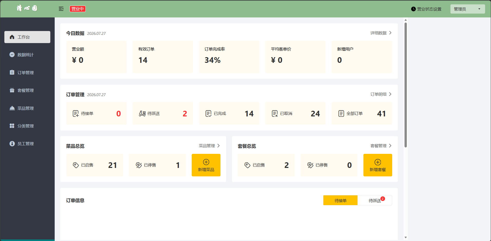
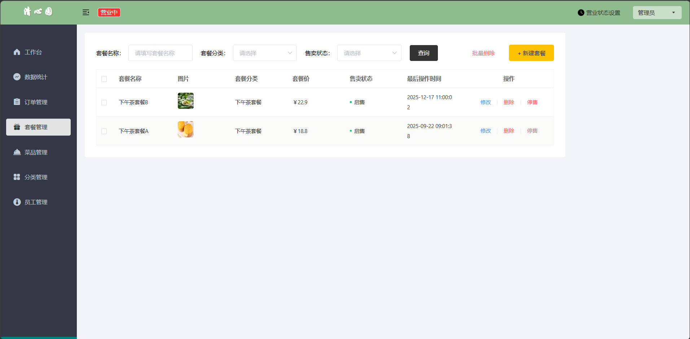
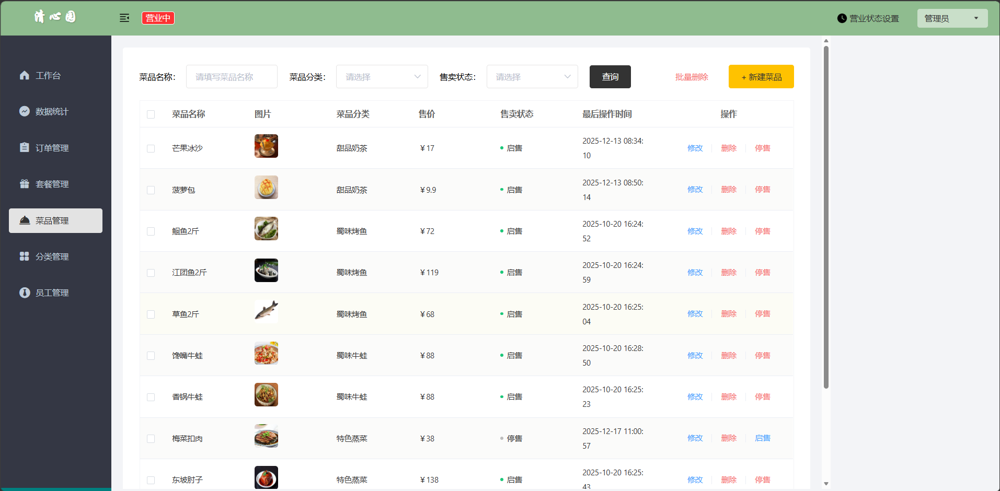
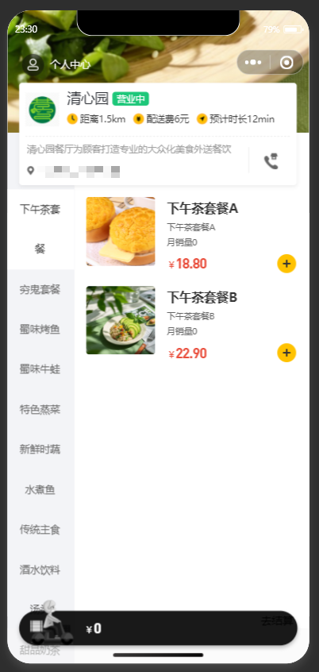
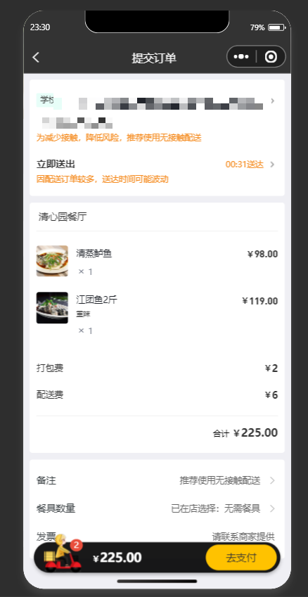
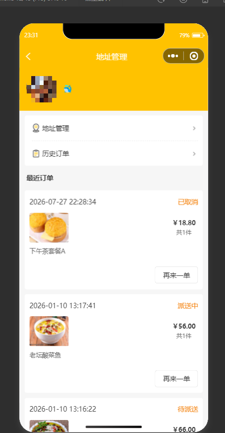

# 清心园（Qingxinyuan）

[](https://github.com/yuyuyuoo55/sky-takeout-qingxinyuan/actions/workflows/docker-quickstart.yml)

本项目基于“苍穹外卖（Sky Take Out）”课程项目进行整理和简单定制，并非完全从零开发。

当前主要调整：

- 项目中文名称由“苍穹外卖”改为“清心园”
- 商家端主视觉调整为绿色与白色
- 整理本地部署结构和运行配置
- 对后端 JWT 验证代码进行了统一整理
- 补充只包含表结构、不包含业务数据的数据库脚本

## 当前状态

目前项目仍以原有餐饮外卖业务功能为主，尚未完成智能化升级。

我正在学习如何将 AI 能力应用到该项目中。后续只会根据实际学习和实现情况逐步更新，不会将尚未完成的功能写成已有成果。

> [!IMPORTANT]
> 公开仓库不包含本机的员工、用户、订单、菜品、套餐等业务数据。Docker 快速启动只会创建一个虚构的演示管理员，其他业务表仍为空。因此，首次运行后没有订单、菜品、套餐等内容属于正常现象，并非前端或接口故障。

## 页面预览

下面截图来自本地开发数据，仅用于展示页面效果。公开仓库不会包含截图中的业务数据。

### 登录页


### 商家工作台



### 套餐管理



### 菜品管理



### 小程序端（隐私已脱敏）

以下截图中的地址、姓名、手机号和个人头像已做打码处理。

| 点餐页 | 提交订单 | 个人中心 |
| --- | --- | --- |
|  |  |  |

## 项目结构

```text
backend/         Java 后端源码
merchant-admin/  商家管理端已构建静态文件和本地代理服务器
miniprogram/     微信小程序编译产物
database/        MySQL 表结构脚本
```

说明：

- 商家管理端当前保留的是已构建 `dist`，不是完整前端源码工程。
- 小程序当前保留的是 uni-app 编译后的 `mp-weixin`，不包含原始 `.vue` 工程。
- `project.config.json` 和 `project.private.config.json` 不上传，请在微信开发者工具中自行创建本地项目配置。

## 技术栈

- Java 17
- Spring Boot 2.7
- MyBatis
- MySQL 8
- Redis
- JWT
- Vue 2 商家管理端构建产物
- 微信小程序编译产物

## 软件架构

```text
商家浏览器
    │ http://127.0.0.1:8888
    ▼
merchant-admin（静态页面与 /api 代理）
    │ /admin
    ▼
Spring Boot 后端：8080
    ├── MySQL：业务数据
    ├── Redis：店铺状态与缓存
    ├── OSS：可选的图片存储
    └── 微信接口：可选的登录与支付能力

微信小程序
    └── /user 请求 Spring Boot 后端
```

## 推荐：Docker 一键启动

这是最省事的运行方式。安装并启动 Docker Desktop 后，只需要 Git 和 Docker，不需要在本机分别安装 Java、Maven、MySQL、Redis、Node.js。

> Docker 一键启动范围仅包括 MySQL、Redis、Java 后端和商家管理端，不包含微信小程序。小程序需要按下方说明手动导入微信开发者工具。

### 1. 克隆并启动

```bash
git clone https://github.com/yuyuyuoo55/sky-takeout-qingxinyuan.git
cd sky-takeout-qingxinyuan
docker compose up --build
```

首次启动需要下载镜像和 Maven 依赖，请耐心等待。看到后端和商家端容器正常运行后访问：

```text
http://127.0.0.1:8888
```

本地演示账号：

```text
用户名：admin
密码：123456
```

该账号只用于本机演示。不要将此默认密码用于公网或生产环境。

### 2. 停止或重置

停止服务并保留数据库：

```bash
docker compose down
```

删除数据库卷并恢复到首次运行状态：

```bash
docker compose down -v
docker compose up --build
```

如果本机的 3306、6379、8080 或 8888 端口已被占用，请先停止占用这些端口的程序。

## 首次运行时的功能范围

Docker 快速启动可以验证：

- 商家端页面访问
- 演示管理员登录
- JWT 验证
- MySQL 与 Redis 连接
- 空业务数据下的管理页面

以下能力需要使用者自行提供第三方配置：

- 菜品图片上传与访问：需要 OSS 配置；公开仓库不包含原项目 OSS 中的图片文件
- 微信小程序登录：需要自己的微信小程序 AppID 和 Secret
- 微信支付与退款：需要商户号、证书和回调地址
- 真机小程序请求：需要局域网地址或已备案的 HTTPS 域名，不能使用手机自身的 `localhost`

## 手动运行

如果不使用 Docker，需要提前安装：

- Java 17
- Maven 3.9+
- MySQL 8
- Redis
- Node.js 18+

### 1. 初始化数据库

创建数据库：

```sql
CREATE DATABASE sky_take_out
  DEFAULT CHARACTER SET utf8mb4
  COLLATE utf8mb4_unicode_ci;
```

然后导入：

```text
database/schema.sql
database/demo-data.sql
```

`schema.sql` 只包含 11 张表的结构，`demo-data.sql` 只创建虚构的本地演示管理员，不包含真实用户、订单或其他业务数据。

因此，新数据库中的业务表默认为空，前端列表没有订单、用户、菜品和套餐等信息属于正常现象。

### 2. 配置环境变量

参考根目录的 `.env.example` 设置本机环境变量。`.env.example` 只是示例文件，直接执行 JAR 时不会被 Spring Boot 自动加载。不要把真实密码、Token 或密钥提交到仓库。

至少需要配置：

```text
DB_HOST
DB_PORT
DB_NAME
DB_USERNAME
DB_PASSWORD
JWT_ADMIN_SECRET
JWT_USER_SECRET
```

Redis 没有密码时可不设置 `REDIS_PASSWORD`。

PowerShell 示例：

```powershell
$env:DB_HOST = "localhost"
$env:DB_PORT = "3306"
$env:DB_NAME = "sky_take_out"
$env:DB_USERNAME = "root"
$env:DB_PASSWORD = "YOUR_DATABASE_PASSWORD"
$env:REDIS_HOST = "localhost"
$env:REDIS_PORT = "6379"
$env:JWT_ADMIN_SECRET = "YOUR_RANDOM_SECRET_WITH_AT_LEAST_32_CHARACTERS"
$env:JWT_USER_SECRET = "ANOTHER_RANDOM_SECRET_WITH_AT_LEAST_32_CHARACTERS"
```

Bash 示例：

```bash
export DB_HOST=localhost
export DB_PORT=3306
export DB_NAME=sky_take_out
export DB_USERNAME=root
export DB_PASSWORD=YOUR_DATABASE_PASSWORD
export REDIS_HOST=localhost
export REDIS_PORT=6379
export JWT_ADMIN_SECRET=YOUR_RANDOM_SECRET_WITH_AT_LEAST_32_CHARACTERS
export JWT_USER_SECRET=ANOTHER_RANDOM_SECRET_WITH_AT_LEAST_32_CHARACTERS
```

### 3. 构建并启动后端

```powershell
cd backend
mvn clean package -DskipTests
java -jar .\sky-server\target\sky-server-1.0-SNAPSHOT.jar
```

Linux 或 macOS 的 JAR 路径写法：

```bash
java -jar ./sky-server/target/sky-server-1.0-SNAPSHOT.jar
```

后端默认端口：

```text
http://127.0.0.1:8080
```

## 商家管理端

后端需先运行在 8080。在新的终端中执行：

```powershell
cd merchant-admin
node .\server.js
```

访问：

```text
http://127.0.0.1:8888
```

本地服务器会将 `/api` 请求代理到后端 `/admin`，并处理工作台 WebSocket 地址。

使用 `database/demo-data.sql` 初始化后，可以使用 `admin / 123456` 登录。

## 微信小程序

小程序不参与 Docker Compose 一键启动。先启动后端，再使用微信开发者工具手动导入：

```text
miniprogram
```

导入时请使用自己的 AppID，或选择适合本地调试的测试方式，并让开发者工具在本地生成项目配置文件。仓库不会上传 `project.config.json` 和 `project.private.config.json`。

本机模拟器可访问 `http://localhost:8080`。真机调试不能使用手机自身的 `localhost`，需要改为局域网地址或已配置的 HTTPS 域名。

## 已验证内容

- Maven 四模块构建成功
- Spring Boot 8080 启动成功
- MySQL 和 Redis 连接成功
- 管理员登录与 JWT 校验成功
- 分类分页数据库接口返回正常
- 商家端登录、工作台数据和 WebSocket 正常
- Docker Compose 配置会通过 GitHub Actions 执行实际启动和演示账号登录检查
- 维护者当前机器未安装 Docker，因此本机只完成了 Maven 构建、Node 语法和配置引用检查

## 给 AI 工具的运行提示

AI 工具克隆仓库后，优先让它检查 Docker 是否可用，然后执行：

```bash
docker compose up --build
```

完成标志：

- MySQL 和 Redis 健康检查通过
- 后端监听 `127.0.0.1:8080`
- 商家端可访问 `http://127.0.0.1:8888`
- 可以使用 `admin / 123456` 登录

如果 Docker 不可用，请让 AI 按“手动运行”章节配置本机依赖和环境变量，不要让它猜测或提交真实密钥。

## 个人职责边界

- 主要负责和学习：Java 后端、数据库表设计、SQL 编写
- 简单接触和整理：商家端、小程序端、本地部署

项目说明、GitHub 展示和简历描述均保持以上真实边界。

## 来源与许可证

本项目来源与个人修改范围见 [ATTRIBUTION.md](./ATTRIBUTION.md)。

商家端包含的 MIT License 见 [merchant-admin/LICENSE](./merchant-admin/LICENSE)。
